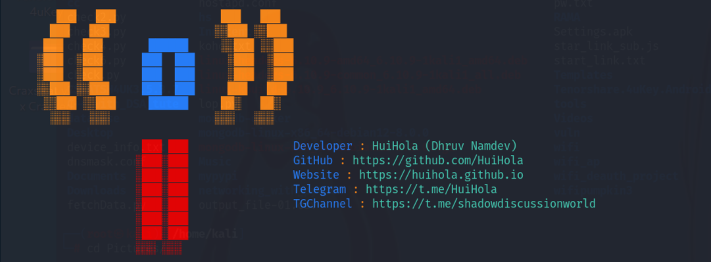

# Difi
<p align="center">
    
</p>

<p align="center">
  
  
  
  
  
  
</p>

**Difi** is a powerful Python-based tool for **scanning** and **deauthenticating** nearby Wi-Fi networks. It leverages the capabilities of `airodump-ng` and `aireplay-ng` from the Aircrack-ng suite to provide a streamlined interface for network monitoring and deauthentication. **Use responsibly and only on networks you have permission to access.**

---
## ⚠️ Legal Disclaimer

> **Disclaimer**: Difi is intended strictly for educational purposes and authorized testing only. Unauthorized use of this tool on networks is illegal and could be punishable by law.  
> 
> **Important:**  
> - Only use Difi on networks you own or have explicit permission to test.
> - The author, HuiHola, disclaims any responsibility for misuse or damage caused by unauthorized use of this tool.
>  
> **By using Difi, you agree to use it responsibly and in accordance with all applicable laws and regulations.**

##  Features

- **Wi-Fi Network Scanning**  
  Discover available Wi-Fi networks within range, with details like network SSID, signal strength, and security type.

- **Device Deauthentication**  
  Deauthenticate devices from a specified Wi-Fi network.

- **Simple CLI Interface**  
  Intuitive command-line interface for easy interaction and streamlined network scanning.

- **Linux Compatibility**  
  Designed to work on Linux systems with `airodump-ng` and `aireplay-ng` installed.

---

##  Requirements

- **airodump-ng**
- **aireplay-ng**

> **Note**: Both are part of the Aircrack-ng suite, commonly available on Linux. Make sure these tools are installed prior to using Difi.

---

##  Installation

1. **Clone the repository**  
```bash
git clone https://github.com/HuiHola/Difi.git
cd Difi
chmod +x setup.sh
./setup.sh
python3 difi.py
```

<p align="center"> <strong>Made with passion for network security enthusiasts</strong> </p>
<p align="center"> <i>Difi: Empowering responsible network security education and practice.</i><br> <i>For any questions or support, please reach out on Telegram or GitHub.</i></p>

